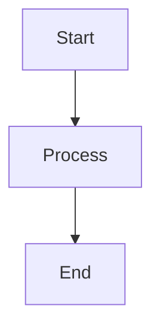

# docs/ — PH-Tools Hub Spoke Convention

This folder is a **spoke** in the PH-Tools documentation hub ([ph-docs](https://github.com/PH-Tools/ph-docs)). The hub sparse-clones this folder at build time, renders all Markdown with Astro, and publishes to [docs.passivehousetools.com](https://docs.passivehousetools.com). The structure here must follow the convention exactly.

## Required Files

| File | Purpose |
|------|---------|
| `index.md` | Library landing page — front-matter feeds the header, title, and pills |
| `nav.yml` | Navigation tree — defines sidebar structure and page discovery |

## nav.yml Format

A single top-level `nav:` key with MkDocs-style entries. Paths are **relative to this `docs/` folder**.

```yaml
nav:
  - Overview: index.md
  - Developer:
    - Architecture: dev/architecture.md
    - Patterns: dev/patterns.md
  - Reference:
    - Model Reference: reference/model-reference.md
```

Top-level leaves become sidebar items. Top-level groups become collapsible sidebar sections. Nested groups are supported.

## Front-matter

### `index.md` — Library landing header

Controls the library landing page header at `/{lib-id}/`:

```yaml
---
title: PHX
subtitle: "Passive House Exchange — format conversion."
version: "1.50.0"
pills:
  - "v1.50.0 — latest"
  - "WUFI · PHPP · Phius"
  - "Python 3.10+"
---
```

All fields are optional. If absent, the hub falls back to the `label` from `libraries.yml`.

### Section card front-matter — Feature grid cards

The library landing page shows a feature grid — one card per top-level nav group. Card metadata lives in the **first file listed under each group** in `nav.yml`.

For example, if `nav.yml` has `Developer: [Architecture: dev/architecture.md, ...]`, then `dev/architecture.md` gets:

```yaml
---
title: Architecture
card_title: Developer Guide
card_description: "Architecture decisions and patterns for extending PHX."
card_index: "01"
---
```

| Field | Purpose |
|-------|---------|
| `card_title` | Card heading (falls back to the nav group label if absent) |
| `card_description` | Card body text |
| `card_index` | Display number on the card (e.g. "01") |

Only the first file in each top-level group needs these fields.

## Optional Folder Structure

```
docs/
├── index.md          # Required — library landing front-matter
├── nav.yml           # Required — navigation tree
├── dev/              # Architecture, patterns, contributor docs
├── reference/        # Schema maps, field guides
└── assets/           # Images, diagrams
```

Organize however makes sense — the hub reads `nav.yml`, not folder names.

## How the Hub Build Works

1. `fetch_spokes.py` sparse-clones `docs/` → `src/content/docs/{lib_id}/`
2. Astro reads `nav.yml` for sidebar + page discovery
3. Astro renders each Markdown file via content collections (Shiki syntax highlighting)
4. Pagefind indexes all content for site-wide search
5. `dist/` is deployed to GitHub Pages

Pushing to `docs/**` on `main` triggers `.github/workflows/notify-hub.yml`, which fires a `repository_dispatch` to ph-docs, rebuilding the live site automatically.

## Mermaid Diagrams

The hub renders fenced `mermaid` code blocks as diagrams (client-side via CDN). Use standard Mermaid syntax:

````markdown

````

- Supported diagram types: flowchart, sequence, class, state, ER, gantt, etc.
- Theme-aware: diagrams pick up light/dark mode automatically on page load
- No spoke-side setup needed — just write the fenced block in any `.md` file
- Pages without mermaid blocks never load the library (conditional CDN fetch)

## Autodoc: Source Code Docstring Format

The hub automatically generates API reference pages from this library's Python source code. The generator (`scripts/generate_api_docs.py` in ph-docs) uses `ast.parse()` and regex to extract classes, attributes, properties, methods, and `# type:` comments — then renders them as Markdown tables.

**The generated pages appear at `api/*.md`** in the built site. The quality of the output depends directly on docstring quality in the source code.

### Python 2.7 Compatibility (Critical)

All source code **MUST remain Python 2.7 / IronPython compatible**. Type information goes in `# type:` comments, NOT annotations:

```python
# YES — type comments (PEP 484 style)
def method(self, arg1, arg2):
    # type: (str, int) -> bool

self.name = ""  # type: str

# NO — modern annotations (FORBIDDEN in this codebase)
def method(self, arg1: str, arg2: int) -> bool:
```

### Class Docstring Format

```python
class SpaceFloorSegment(_base._Base):
    """A single floor area polygon within a PH Space.

    Represents one contiguous floor region with its own geometry and
    weighting factor for iCFA/TFA calculations.

    Attributes:
        geometry (Optional[LBFace3D]): The planar 3D face geometry.
            None if not yet assigned.
        weighting_factor (float): Multiplier for iCFA/TFA area calculation.
            Default: 1.0 (no reduction).
    """
```

- **Line 1**: One-sentence summary (what IS this thing?)
- **Lines 2+** (optional): Extended context, relationships, PH-domain notes
- **`Attributes:` section**: Lists public instance attributes set in `__init__`. Format: `name (Type): Description.` — multi-line descriptions indent 4 extra spaces.

### Property Docstring Format

```python
@property
def weighted_floor_area(self):
    # type: () -> float
    """Floor area weighted by the iCFA/TFA reduction factor."""
```

- One-line docstring is sufficient for most properties
- The `# type: () -> ReturnType` comment on the line after `def` provides the return type

### Method Docstring Format

```python
def add_floor_segment(self, segment):
    # type: (SpaceFloorSegment) -> None
    """Add a floor segment to this space.

    Arguments:
    ----------
        * segment (SpaceFloorSegment): The floor segment to add.

    Returns:
    --------
        * None
    """
```

- **Line 1**: Imperative summary ("Add", "Return", "Calculate")
- **`Arguments:` section**: Required if the method takes args beyond `self`/`cls`
- **`Returns:` section**: Required if return type is non-obvious
- The `# type: (ArgTypes...) -> ReturnType` comment is the machine-readable source

### Enum / CustomEnum Docstring Format

```python
class PhFoundationType(enumerables.CustomEnum):
    """Classification of foundation types for PH certification.

    Values:
        1-HEATED_BASEMENT: Fully conditioned basement.
        2-UNHEATED_BASEMENT: Unconditioned basement below thermal envelope.
        3-SLAB_ON_GRADE: Foundation slab directly on soil.
    """
    allowed = [
        "1-HEATED_BASEMENT",
        "2-UNHEATED_BASEMENT",
        "3-SLAB_ON_GRADE",
    ]
```

- **`Values:` section**: Lists each allowed value and its meaning
- The generator reads `allowed` for the values list, and the `Values:` docstring for descriptions

### What NOT to Document

Do not add docstrings to these — they are excluded by the generator:
- `to_dict()` / `from_dict()` / `duplicate()` / `__copy__()`
- `__str__` / `__repr__` / `__hash__` / `ToString`
- Private methods (`_foo`) — internal implementation
- Trivial property getters that just expose `self._x` with no transformation

### Inline `# type:` Comment Rules

| Location | Format | Example |
|----------|--------|---------|
| Method/property (line after `def`) | `# type: (ArgTypes) -> Return` | `# type: (str, int) -> bool` |
| Property (line after `def`) | `# type: () -> Return` | `# type: () -> float` |
| Attribute (end of assignment) | `# type: Type` | `self.x = None  # type: Optional[Foo]` |

If no `# type:` comment exists, the generator infers type from literals (`1.0` → `float`, `""` → `str`, etc.) but explicit comments are preferred for clarity.

## Rules

- **Every `.md` file must be listed in `nav.yml`** — unlisted files won't be discovered or rendered
- **No cross-repo relative links** — link to other libraries via absolute site URLs (`/honeybee-ph/...`), not `../`
- **Standard Markdown + Mermaid** — the hub renders with Astro's Markdown pipeline; fenced `mermaid` blocks render as diagrams; no other non-standard syntax
- **Images/assets** — put in a local `assets/` subfolder; reference with relative paths
- **Don't duplicate hub content** — the hub owns cross-cutting content; spokes own library-specific content
