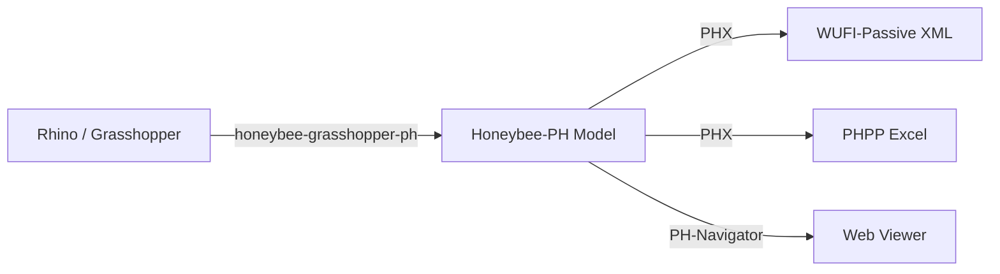

# Getting Started

Honeybee-PH is a free plugin for [Ladybug Tools](https://www.ladybug.tools/) that adds
Passive House data to [Honeybee](https://github.com/ladybug-tools/honeybee-core) energy models.
Both [Passive House Institute (PHI)](https://passivehouse.com/) and
[Passive House Institute US (Phius)](https://www.phius.org/) model data are supported.

> This plugin is not affiliated with or created by PHI or Phius.

## Prerequisites

Honeybee-PH extends the Ladybug Tools ecosystem. You will need:

- [Ladybug Tools](https://www.ladybug.tools/) v1.9 or higher
- [Rhino 3D](https://www.rhino3d.com/) + Grasshopper (for the visual scripting workflow)
- [honeybee-grasshopper-ph](https://github.com/PH-Tools/honeybee_grasshopper_ph) (Grasshopper components)

## Installation

Install from PyPI:

```bash
pip install honeybee-ph
```

For Grasshopper usage, install via the Ladybug Tools plugin manager or follow the
[honeybee-grasshopper-ph](https://github.com/PH-Tools/honeybee_grasshopper_ph) instructions.

## Typical Workflow



1. **Model** your building geometry in Rhino and assign Passive House attributes using the
   [Grasshopper components](https://github.com/PH-Tools/honeybee_grasshopper_ph).
2. **Export** the Honeybee-PH model (HBJSON) to PHPP or WUFI-Passive using
   [PHX](/phx/).
3. **Review** your model in the browser with
   [PH-Navigator](https://github.com/bldgtyp/ph-navigator).

## Links

- [Source Code (GitHub)](https://github.com/PH-Tools/honeybee_ph)
- [PyPI](https://pypi.org/project/honeybee-ph/)
- [Passive House Tools](https://www.passivehousetools.com)
